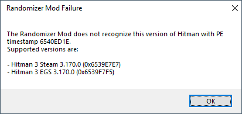

# Updating the Randomizer Mod

## Disclaimer

Following these instructions and running the Randomizer mod is always done at
your own risk. I am not responsible for any issues arising from following these
instructions or running the mod, including and up to loss of data, hardware
failure, moderation action against your account by IO Interactive, Epic, Valve,
or any other associated party.

I am not the original author of the Randomizer Mod, and only have a vague idea
of how it works.

## Introduction

The Randomizer Mod works by routing specific instructions in `HITMAN3.exe` to
its custom implementation. Because new builds of the executable inevitably
rearrange its memory layout, those instructions need to be found and assigned in
every new build.

There are seven 'offsets' we care about. Two of them are references to
functions, four of them are references to function pointers, and one of them is
a reference to a location in the binary data that refers to a function.

In source code, these offsets are stored in Offsets.cpp, and look like this:

```c
offsets.pPushItem0 = reinterpret_cast<void*>(0x140db1330);
offsets.pPushItem1 = reinterpret_cast<void*>(0x140db1920);
offsets.pPushHeroInventoryDetour = reinterpret_cast<void*>(0x1407dbb23);
offsets.pPushNPCInventoryDetour = reinterpret_cast<void*>(0x1400e0261);
offsets.pPushStashInventoryDetour = reinterpret_cast<void*>(0x140236564);
offsets.pPushWorldInventoryDetour = reinterpret_cast<void*>(0x140dab95a);
offsets.pZEntitySceneContext_LoadScene = reinterpret_cast<void**>(0x141d831c8);
```

These are the locations in the executable we need to find in each new release.

## PE Timestamps

Every version of the HITMAN executable has a PE timestamp that more-or-less
uniquely identifies it. It's easy to find these by running a new version of
HITMAN with an old version of the mod. Its error message will return the PE
timestamp:



These timestamps must be set in `Version.cpp` in order for the mod to assign the
correct offsets depending on which version of the executable you're running
(there are typically three binaries introduced in each release, one for the Epic
Games Store and two on Steam. I don't know how Steam chooses which binary a
given player receives, but their memory offsets are typically the same.)

## Locating the Offsets

The exact location of the offsets can't be known when we first inspect the
executable. However, there are nearby sets of assembly instructions that can be
used to localize them.

- pushItem0: `4c 89 60 68 4c 89 60 70`
- pushItem1: `48 8b 9c 24 e0 00 00 00 48 8b bc 24 d8 00 00 00 41 0f 28 48 10`
- pushHeroInventoryDetour: `f3 0f 7f 45 f7 48 89 7d 07 48 c7 45 df 00 00 00 00`
- pushNpcInventoryDetour: `f3 0f 7f 45 1f 48 c7 45 2f 06 00 00 00 40 88 75 37`
- pushStashInventoryDetour: `c7 45 07 00 00 00 80 0f 29 4d 17`
- pushWorldInventoryDetour: `80 8b 33 01 00 00 02`
- pointedToByZEntitySceneContext_LoadScene: `0f b6 47 28 48 8d 57 30 41 88 47 38 49 8d 4f 40 0f b6 47 29 41 88 47 39`

These 'instruction patterns' are relatively unique within the current versions
of the binaries and thus make it easy to find the offsets we want nearby.

### Locating `pushItem0` and `pushItem1`

The first two offsets are function references. The instruction patterns are
within those functions, so finding them is a matter of locating the instruction
pattern and then using the location of the enclosing function definition.

If found correctly, `pushItem0` should have the following function signature:

```c
int FUN_140db1330(longlong param_1,longlong *param_2,undefined8 param_3,undefined4 *param_4,
                  undefined8 param_5,undefined8 param_6,undefined8 *param_7,undefined8 *param_8,
                  longlong **param_9,char param_10)
```

And `pushItem1` should have the following function signature:

```c
undefined4 FUN_140db1920(undefined8 param_1,undefined8 param_2,undefined4 *param_3,
                         undefined8 param_4, undefined8 param_5,undefined8 *param_6,
                         undefined8 *param_7)
```

### Locating the Detours

Whereas `pushItem0` and `pushItem1`'s offsets are references to the function
definitions, the detours are function calls inside unrelated functions that we
need to reroute.

When using the instruction pattern for pushHeroInventoryDetour, we should find
the result in a function with the following signature:

```c
undefined8 FUN_1407db950(longlong param_1,undefined4 *param_2,undefined8 param_3,undefined8 param_4,
                         undefined4 param_5)
```

The location of the function call we care about will look like this, about 115
lines into the function:

```c
local_80 = FUN_140db1330(&DAT_14317d1a0,param_2,param_3,&local_48,uVar5);
```

The address of that instruction is the detour.

Proceed similarly for the next three detours.

pushNPCInventoryDetour is in a function with the following signature:

```c
undefined8 FUN_1400e01d0(longlong param_1,code **param_2)
```

and the location of the function call is about 40 lines into the function:

```c
local_48[0] = FUN_140db1920(&DAT_14317d1a0,param_2,&local_88,uVar1);
```

pushStashInventoryDetour is in a function with the following signature:

```c
uint FUN_1402363c0(longlong *param_1,longlong *param_2,undefined8 param_3,char param_4)
```

and the location of the function call is about 80 lines into the function:

```c
uVar1 = FUN_140db1330(&DAT_14317d1a0,param_2,local_58,&local_48,uVar2);
```

pushWorldInventoryDetour is in a function with the following signature:

```c
void FUN_140dab7b0(longlong *param_1)
```

and the location of the function call is about 80 lines into the function:

```c
iVar1 = FUN_140db1920(&DAT_14317d1a0,&local_48,&local_38,uVar2);
```


### Locating the LoadScene function reference

Unlike the above offsets, the offset for `pZEntitySceneContext_LoadScene` is
located in the data region of the binary. Using the instruction pattern above,
we should find a function with the following signature:

```c
undefined8 FUN_1400c88c0(longlong *param_1,longlong param_2)
```

You will now need to find the reference to this function in the data region. In
Ghidra, the search result for the reference will look like this:

> `141d831c8`		addr `FUN_1400c88c0` (pointer[29][17])	DATA

That is the address of the function reference that we require.

### Finishing Up

At this point you should have

1. Updated the PE Timestamps in `Version.cpp` to match the current versions of
   the release binaries.
2. Found the locations of all seven offsets for each release and updated them in
   `Offsets.cpp`.

The final step is to build the DLL and test it. The original version of the
Randomizer used CMake, but I added a configuration for [Bazel][], which I'm more
familiar with, and have not kept the CMake build configuration up-to-date.
Install Bazel and at the command line in the project directory, run

```sh
$ bazel build :DINPUT8.dll
```

The DLL will be located in `bazel-bin`, which can then be copied to the Retail
directory of your HITMAN installation.

[Bazel]: https://bazel.build/